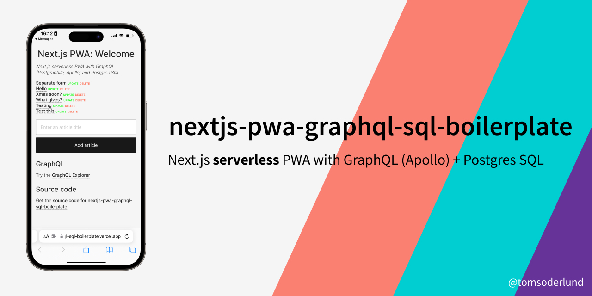
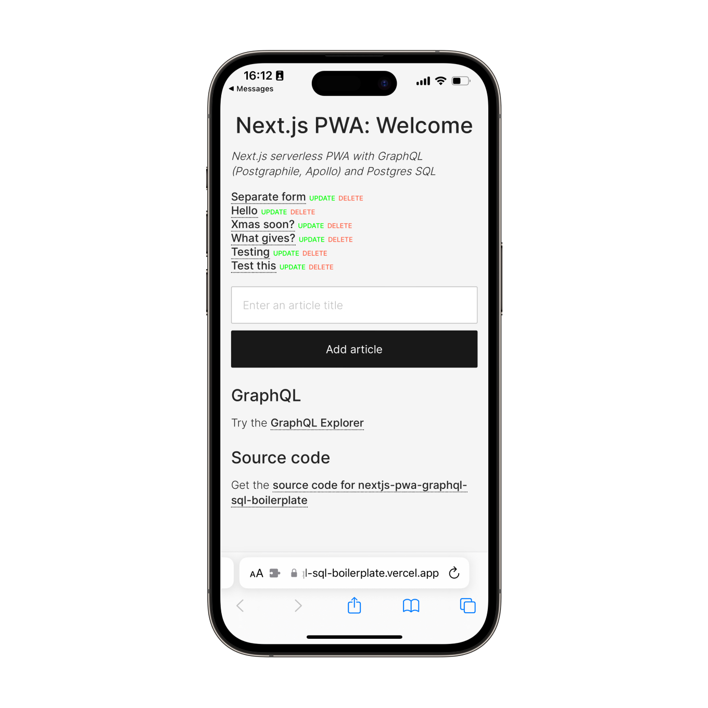

# Next.js serverless PWA with GraphQL (Postgraphile, Apollo) and Postgres SQL boilerplate

**Note:** this is a new version using Postgraphile. See branch `old-graphql-server` if you want the old version.

_Note: this is my v3 boilerplate for React web apps. See also my [Firebase and React Hooks boilerplate](https://github.com/tomsoderlund/nextjs-pwa-firebase-boilerplate), [Redux + REST + Postgres SQL boilerplate](https://github.com/tomsoderlund/nextjs-sql-rest-api-boilerplate) and [REST + MongoDB boilerplate](https://github.com/tomsoderlund/nextjs-express-mongoose-crudify-boilerplate)._

## Why is this awesome?

This is a great template for a any project where you want **React (with Hooks)** (with server-side rendering, powered by [Next.js](https://github.com/vercel/next.js)) as frontend and **GraphQL and Postgres SQL** as backend.
_Lightning fast, all JavaScript._

- Great starting point for a [PWA (Progressive Web App)](https://en.wikipedia.org/wiki/Progressive_web_applications).
- Data objects defined in Postgres database, and then propagated all the way to React frontend (with full TypeScript support).
- Both front-end client and GraphQL/SQL server in one project.
- Can be deployed as [serverless functions on Vercel](#deploying-serverless-on-vercel).
- A fast Postgres SQL database server.
- [GraphQL API](#graphql-client-and-server) with Apollo.
- React Hooks for business logic.
- PWA features such as `manifest.json` and offline support (`next-offline`).
- Easy to style the visual theme using CSS (e.g. using [Design Profile Generator](https://tomsoderlund.github.io/design-profile-generator/)).
- `sitemap.xml` and `robots.txt` support.
- Google Analytics and `google-site-verification` support (see `config/config.js`).
- Flexible configuration with `config/config.js` and `.env` file.
- Unit testing with Jasmine (`yarn unit`).
- Code linting and formatting with StandardJS (`yarn lint`/`yarn fix`).

## Demo

See [**nextjs-pwa-graphql-sql-boilerplate** running on Vercel here](https://nextjs-pwa-graphql-sql-boilerplate.vercel.app/).

## How to use

Clone this repository:

    git clone https://github.com/tomsoderlund/nextjs-pwa-graphql-sql-boilerplate.git [MY_APP]

Remove the .git folder since you want to create a new repository

    rm -rf .git

Install dependencies:

    cd [MY_APP]
    yarn

Set up Postgres database, either:

1. Get a cloud Postgres database from [Vercel](https://vercel.com/docs/storage/vercel-postgres), AWS or similar.
2. Local PostgresInstall Postgres and set up the database:

    psql postgres  # Start the Postgres command-line client
    
    CREATE DATABASE "nextjs-pwa-graphql-sql";  -- You can also use \connect to connect to existing database
    \connect "nextjs-pwa-graphql-sql";
    CREATE TABLE article (id serial, title varchar(200), content text);  -- Create a blank table
    INSERT INTO article (title) VALUES ('The first article');  -- Add example data
    SELECT * FROM article;  -- Check data exists
    \q

Create the `.env` file, then add `DATABASE_URL`:

    cp .env.example .env

Start it by doing the following:

    yarn dev

In production:

    yarn build
    yarn start

If you navigate to `http://localhost:3003/` you will see a web page with a list of articles (or an empty list if you haven’t added one).

### GraphQL client and server

Your GraphQL API server is running at `http://localhost:3003/api/graphql`.
Your GraphQL Explorer is running at `http://localhost:3003/api/graphiql`.
[Try the GraphQL Explorer](https://nextjs-pwa-graphql-sql-boilerplate.vercel.app/api/graphiql) on the demo server.

## Modifying the app to your needs

### Change app name

Do search/replace for "nextjs-pwa-graphql-sql-boilerplate" AND "nextjs-pwa-graphql-sql" to something else.

Change name in `public/manifest.json`

### Change port number

Do search/replace for `3003` to something else.

### Renaming “Article” to something else

The database item is called “Article”, but you probably want something else in your app.

Rename the files:

    mkdir graphql/collections/{newName}
    git mv graphql/collections/article/hooks.ts graphql/collections/{newName}
    git mv graphql/collections/article/queries.ts graphql/collections/{newName}
    git mv graphql/collections/article/resolvers.ts graphql/collections/{newName}
    git mv graphql/collections/article/schema.sql graphql/collections/{newName}
    git mv graphql/collections/article/serverQueries.ts graphql/collections/{newName}
    rm -r graphql/collections/article

    mkdir -p components/{newName}s
    git mv components/articles/CreateArticleForm.tsx components/{newName}s/Create{NewName}Form.tsx
    git mv components/articles/ArticleList.tsx components/{newName}s/{NewName}List.tsx
    git mv components/articles/ArticleListItem.tsx components/{newName}s/{NewName}ListItem.tsx
    git mv components/articles/ArticleDetails.tsx components/{newName}s/{NewName}Details.tsx
    rm -r components/articles

    mkdir pages/{newName}s
    git mv "pages/articles/[articleSlug].tsx" "pages/{newName}s/[{newName}Slug].tsx"
    rm -r pages/articles

Then, do search/replace inside the files for different casing: article, Article, ARTICLE

### Create a new data model/object type

    yarn new:collection  # Creates a new folder graphql/newObject with 4 empty JS files inside

### How to remove/replace SQL database

1. Remove references to `graphql/postgres`
2. `graphql/collections/article/resolvers.js`: remove “sql*” references

### Change visual theme (CSS)

1. Change colors in `public/manifest.json`
2. Change CSS in `public/app.css`
3. Change font in `PageHead.js`

## Support this project

Did you or your company find `nextjs-pwa-graphql-sql-boilerplate` useful? Please consider giving a small donation, it helps me spend more time on open-source projects:

